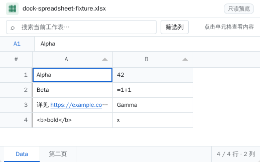
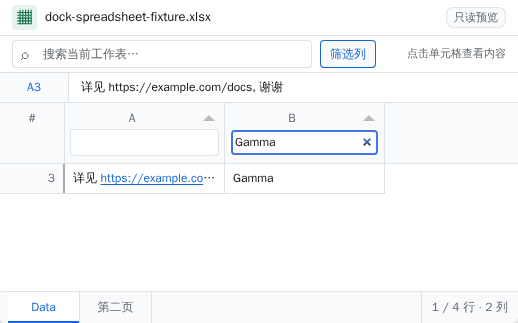
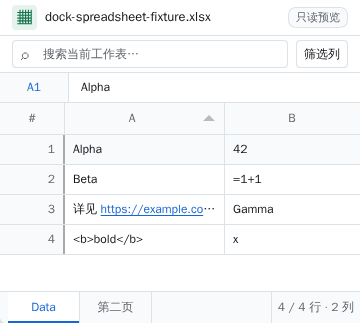

# dock-spreadsheet

[English](README.en.md) · [简体中文](README.md)

[](https://www.npmjs.com/package/dock-spreadsheet) [](LICENSE) 

**为 [dock-files](https://github.com/AKS1st/dock-files) 提供只读在线表格查看器。** 在 [dock](https://github.com/AKS1st/dock) 工作台内打开 XLSX、XLS、ODS、CSV 和 TSV 文件，无需将文件上传到外部服务。使用成熟的 [SheetJS CE](https://docs.sheetjs.com/)、[Papa Parse](https://www.papaparse.com/) 和 [Tabulator](https://tabulator.info/) 实现解析、虚拟滚动与交互；没有 CDN 运行时依赖。

> **范围声明：只读预览。** 本插件不编辑/保存文件，不计算公式或运行宏，也不复刻源文件的字体、颜色、合并单元格、图表或打印布局。

## 效果预览

以下图片来自隔离 `dsh web` + Chromium 实际运行，工作簿内容是虚构测试数据；截图已裁去工作区和会话界面。



<details>
<summary>查看列筛选效果</summary>



</details>

<details>
<summary>查看 360px 窄浮窗效果</summary>



</details>

## 功能

- **表格格式**：自动接管 dock-files 中的 `.xlsx`、`.xls`、`.ods`、`.csv`、`.tsv` 文件；多工作表通过底部标签切换，支持方向键、Home/End。
- **熟悉的网格**：字母列头、冻结的真实行号、细网格线、单元格选中高亮；信息栏展示选中单元格的坐标和纯文本，过长时悬停可查看完整值。第一行始终是数据，不猜测表头。
- **查找和筛选**：跨当前工作表的数据列搜索；点击列头排序；按需展开每列的筛选框。收起列筛选时自动清空对应条件，避免隐藏筛选。底部显示可见行数 / 预览行数和列数。
- **链接导航**：识别单元格文本中的 `http://`、`https://` 和 `www.`；**Ctrl+点击**（macOS 为 **⌘+点击**）在新标签页打开，普通点击只选中单元格。裸域名和邮箱不自动识别。
- **大表预览**：Tabulator 虚拟滚动，仅渲染可见行；窄浮窗下标签可横向滚动，工具栏自动收起辅助提示。
- **坐标保真**：保留偏移起始工作表的列字母与行号（例如 `C3`）；空白单元格保持为空。

## 安装

需要 DSH Web、Node.js ≥20，以及已启用的 [`dock-base`](https://github.com/AKS1st/dock) 和 [`dock-files`](https://github.com/AKS1st/dock-files)。**按顺序安装这三个顶层插件**；基础插件仅作为依赖下载并不等于自动挂载。

### npm（推荐）

```sh
dsh plugin --profile web add dock-base
dsh plugin --profile web add dock-files
dsh plugin --profile web add dock-spreadsheet
```

### GitHub（备选）

```sh
dsh plugin --profile web add github:AKS1st/dock
dsh plugin --profile web add github:AKS1st/dock-files
dsh plugin --profile web add github:AKS1st/dock-spreadsheet
```

本地开发可用 `dsh plugin --profile web add link:/absolute/path/to/dock-spreadsheet`。**安装或更新插件后由你重启 dsh web** 才能保证新 bundle 生效；本插件不会自行重启进程。profile 的 `node_modules/dock-spreadsheet` 必须能解析，仅把名字写进 bundle 列表不足以安装；若 profile 位于只读挂载，先解决文件系统可写性。

## 使用方法

1. 在 dock-files 文件浏览器中打开受支持的表格文件，查看器会以 dock 浮窗打开。无需另外寻找活动栏入口。
2. 点击任意数据单元格，在上方信息栏查看原始表格坐标及文本（过长时悬停查看完整值）。对链接使用 Ctrl/⌘+点击打开新标签页。
3. 在搜索框输入文本以筛选当前工作表；点击列头排序；点击“筛选列”显示/收起列头筛选输入框。搜索与列筛选可同时生效。
4. 点击底部工作表标签切换；键盘聚焦标签时可使用 ←/→、Home/End。切表后旧单元格选中态会清空。

## 格式、边界与安全

| 项目 | 实际行为 |
| --- | --- |
| Excel / OpenDocument | SheetJS CE 0.20.3 读取 `.xlsx`、`.xls`、`.ods`；显示单元格的格式化/缓存文本，不重新计算公式。 |
| 分隔文本 | Papa Parse 读取 `.csv`、`.tsv`；严格 UTF-8 解码，编码不符时明确报错。第一行是数据而非自动表头。 |
| 预览范围 | 每张表从已使用区域起最多预览 **5000 行、256 列**；超出范围在状态栏标记“预览受限”。 |
| 文件访问 | Host 只提供 `POST /dock-spreadsheet/read` 原始字节读取，检查同源/可信主机、绝对路径、允许扩展名、常规文件及 **20 MiB** 上限；没有写入 API。 |
| 工作区边界 | 与其他 dock 查看器一致，允许读取会话指向的**工作区外绝对路径**；请勿将插件装入不可信或公开可访问的 Host。 |
| 内容渲染 | 工作簿内容按不可信数据处理：文本通过 DOM `textContent`/文本节点输出，不使用 `innerHTML`；`<b>` 等输入不会成为 HTML。检测到的链接只允许 `http(s)`，以 `noopener,noreferrer` 打开。 |
| 性能 | 虚拟滚动降低 DOM 开销，但解析仍在浏览器主线程进行；接近上限的复杂工作簿可能短暂卡顿。 |

本插件不是完整电子表格引擎：不提供编辑、保存、协同、公式求值、宏执行、图表、合并单元格样式复刻或非 UTF-8 CSV 自动猜测。

## 开发与验证

```sh
pnpm install
pnpm run check   # 生成内嵌 Tabulator 样式并检查 TypeScript
pnpm test        # 构建 Host / Client 并运行 18 项测试
pnpm run build   # 生成需随 GitHub/npm 发布的 lib/
```

单元/集成测试覆盖五种文件格式、坐标和预览上限、Host 读取防线、浏览器 bundle 注册，以及真实 React + Tabulator 挂载后的搜索、排序、切表、筛选按钮、单元格选中和链接交互。在独立容器中，以随机端口启动真实 `dsh web` 并驱动 Chromium，**29/29 项检查通过**（包括 360px 浮窗、列筛选、HTML 作为文本和 Ctrl+点击）。这不是对用户当前 GUI 热更新或 npm 发布状态的保证。

客户端产物内置 SheetJS、Papa Parse、Tabulator 和样式；浏览器端只将平台提供的 React 保留为外部依赖。GitHub 安装使用仓库已提交的 `lib/`，不需要消费者运行构建脚本，也不声明 `prepare`/`postinstall`。

## 故障排查

| 现象 | 排查 |
| --- | --- |
| 文件仍被默认文本查看器打开 | 检查 dock-base、dock-files、dock-spreadsheet 均在 Web profile 的 bundle 列表且依赖可解析；由你重启 dsh web 后再打开。 |
| 安装时报 `EROFS` | Web profile 的 `node_modules` 位于只读文件系统；使该目录可写后重新安装，不要只改清单。 |
| CSV/TSV 编码错误 | 将输入转为 UTF-8；查看器不会将其他编码静默显示为乱码。 |
| 文件太大或未显示全部数据 | 单文件不能超过 20 MiB；每张表最多预览 5000 行/256 列，留意底部“预览受限”。 |
| Ctrl+点击没打开网页 | 确认单元格文本具有 `http(s)://` 或 `www.` 前缀、点击链接本身，且浏览器没有拦截新标签页。 |

## 许可与致谢

[MIT](LICENSE)。感谢 [SheetJS CE](https://docs.sheetjs.com/)、[Papa Parse](https://www.papaparse.com/) 与 [Tabulator](https://tabulator.info/) 项目。
